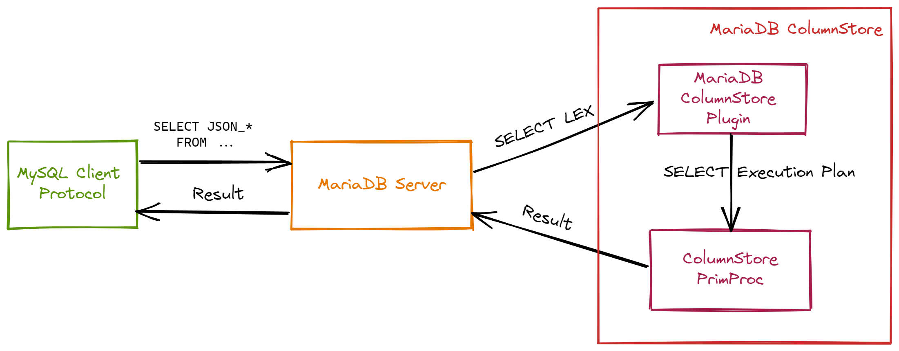

# GSoC 2022 Final Report

## Introduction


- **Organization:** [MariaDB Corporation](https://github.com/mariadb-corporation?type=source)
- **Project:** [Implement DISTRIBUTED JSON Functions](https://summerofcode.withgoogle.com/programs/2022/projects/VIJfR79a)
- **Pull Request:** :white_check_mark:[MCOL-785](https://github.com/mariadb-corporation/mariadb-columnstore-engine/pull/2425): Implement DISTRIBUTED JSON functions: (reviewed, code 8600+ lines, tests 2000+ lines)

## About Projects

**ColumnStore (MCS)** is a large-scale **columnar storage engine** based on a parallel distributed data architecture. I am mainly responsible for **adding support for the `JSON_*` functions** into the existing functions.



<center>Support for Columnstore JSON functions</center>

The JSON functions I need to implement: [Full List](https://mariadb.com/kb/en/json-functions/) **(34 functions)**

## Result

After Feature is merged, user can use ColumnStore as storage engine and call JSON function in SELECT SQL.

```sql
MariaDB [(none)]> USE test;
Database changed
MariaDB [test]> CREATE TABLE json_test(j LONGTEXT) ENGINE=ColumnStore;
Query OK, 0 rows affected (0.231 sec)

MariaDB [test]> INSERT INTO json_test VALUES(2022),('"hello GSoC2022"');
Query OK, 2 rows affected (0.176 sec)
Records: 2  Duplicates: 0  Warnings: 0

# calling JSON_* in ColumnStore table
MariaDB [test]> SELECT j AS json, JSON_TYPE(j) AS type FROM json_test;
+------------------+---------+
| json             | type    |
+------------------+---------+
| 2022             | INTEGER |
| "hello GSoC2022" | STRING  |
+------------------+---------+
2 rows in set (0.050 sec)
```

## Implement

During GSoC development, not only did I complete functional development such as **JSON functions support**, I also did extra work to make the feature more efficient and robust, summarized as follows:

| Checklist                                                    | Effect                                            |
| ------------------------------------------------------------ | ------------------------------------------------- |
| **Boolean Adaptation** - Adapted for JSON and MariaDB Boolean incompatibility issues | Boolean **fully** compatible                      |
| **RAII Encapsulation** - Use Exception, RAII and other features to encapsulate code | Stronger **exception-safe** and **resource-safe** |
| **Constant Cache** -  Cache constants such as json path during function execution | **Greatly improves** efficiency of functions      |
| **SQL Test **- Use the `Mysql-test-run` test framework to write test cases | Test coverage rate reaches **90%**                |

Also, during development, I submitted **3 additional patches** to [MariaDB/Server](https://github.com/MariaDB/server) that have been merged so far:

- :white_check_mark:[Refactor](https://github.com/MariaDB/server/pull/2209): remove redundant assignments of `JSON_MERGE_PATCH`;

- :white_check_mark:[MDEV-28947](https://github.com/MariaDB/server/pull/2172): `JSON_TYPE` result is turncated, charset max length should be considered;

- :white_check_mark:[MDEV-29264](https://github.com/MariaDB/server/pull/2226): JSON function overflow error based on `LONGTEXT` field.

## Acknowledgment

This GSoC experience has greatly improved my coding ability and confidence, I think I have a huge gain in the following areas:

- Deeper understanding of the parsing and execution process of JSON and SQL functions
- More familiar with the compilation and debugging of C/C++ code
- Better understanding of test case design;

Since then, I have developed a great interest in open source and Database System. Iam willing to continue to contribute to open source in the future. Thanks to the MariaDB community and my mentor [Roman Nozdrin](Roman Nozdrin) and [David Hall](https://github.com/dhall-MariaDB), to some extent the openness of the community and the patience and responsibility of the mentor are one of the biggest reasons for my interest in open source.

## Reference

- [JIRA issue](https://jira.mariadb.org/browse/MCOL-785)
- [Design docs](https://docs.google.com/document/d/1Kt41H61QCfTgBMgFB6i77URc7jNppWL9Ph_5_-LEBOU/edit?usp=sharing)
